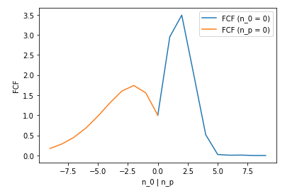
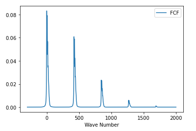
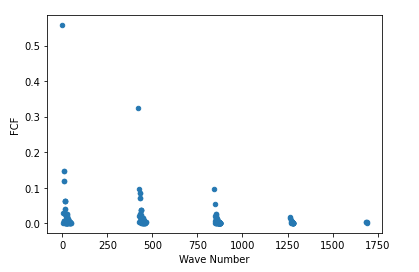
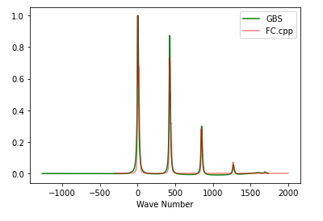

## Project 3: Franck-Condon Factors

## Tasks 

### Task1
- In this task we calculate single-mode FCF against different excitation states. ([Notebook](Task1.ipynb))

### Task2
- In this task we calculate multi-mode FCF of V3 by Hermite polynomial approach. ([Notebook](Task2.ipynb))

### Task3
- In this task we calculate multi-mode FCF of V3 by Gaussian Boson sampling approach. ([Notebook](Task3.ipynb))

## Further Challenges:

- Calculate FCF by Loop Hafnian ([Notebook](Challenge1.ipynb))
- Calculate FCF of H2O ([Notebook](Challenge2.ipynb))
- Discussion of 3 methods to calculate FCF ([Markdown](Challenge3.md))
- Discussion of licenses ([Markdown](Challenge4.md))

## Business Application

[link](Business_Application.md)